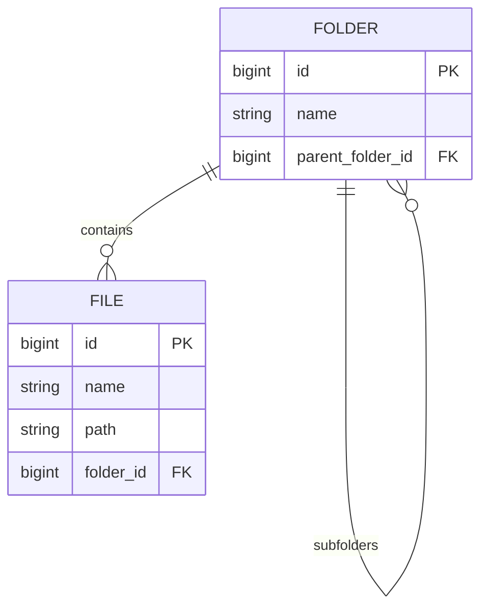

# Entity Relationship Diagram  

```mermaid
erDiagram
    FOLDER {
        bigint id PK
        string name
        bigint parent_folder_id FK
    }
    FILE {
        bigint id PK
        string name
        string path
        bigint folder_id FK
    }
    FOLDER ||--o{ FILE : contains
    FOLDER ||--o{ FOLDER : subfolders
```
