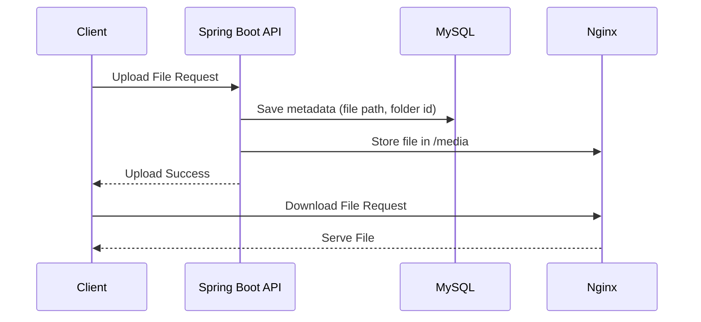

# Upload & Download Sequence  

```mermaid
sequenceDiagram
    participant Client
    participant API as Spring Boot API
    participant DB as MySQL
    participant Nginx

    Client->>API: Upload File Request
    API->>DB: Save metadata (file path, folder id)
    API->>Nginx: Store file in /media
    API-->>Client: Upload Success

    Client->>Nginx: Download File Request
    Nginx-->>Client: Serve File
```
